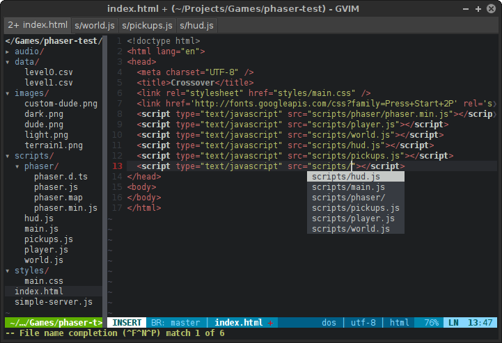

# tlhunter's .vimrc



This Vim configuration is meant to make Vim feel more like an IDE than a simple console-based text editor. I use it mostly under GVIM (both MacVIM as well as Linux GVim) though I occasionally run it directly in a terminal (the experience is slightly diminished). First and foremost this is the configuration I use on my home and work machines, so I make no guarantee that `master` makes perfect sense.

## Installation

Run these commands to get this Vim configuration working on your OS X or Linux machine:

```bash
cd ~
git clone git://github.com/tlhunter/vimrc.git .vim
ln -s ~/.vim/vimrc ~/.vimrc
```

## Overview

This configuration is primarily intended to be run with GVim editing multiple files at the same time. On the left side of the screen will be the file browser, and on the right will be the list of tags in the current file. On the bottom you will see a list of the currently opened files (buffers) when switching between them, otherwise it will show status items. You will also see the name of the current Git branch in parenthesis (if you are in one).

When you want to edit a file, you can browse to it the file browser on the left, or use _Ctrl p_ to open up a quick/fuzzy search. If you want to edit yet another file, browse to it and open it just like before. When you want to move between open files, use the buffer movement keys mentioned below. Feel free to open as many simultaneous files as you want as if this were any other IDE.

## Features

* File Browser on left side of screen
* Functions, Variables, Classes on right
* Move between files in center screen
* View status of the current GIT repo, if applicable
* Additional features when running under MacVIM

## Keyboard Shortcuts

### Switching between files (Buffers)

* Use _,q_ to close the current file (a different file will appear in its place)
* Use _Ctrl h Ctrl l_ to move between open files
 * _Ctrl Left Ctrl Right_ also works for switching between files
 * While in MacVim, you can swipe left and right to switch between open files
* Use _Cmd Shift N_ (or _Alt n_ in Linux GVim) to open a new empty buffer

### Viewports (Windows/Splits)

* Use _,h ,j ,k ,l_ to navigate between viewports
* Use _,Q_ to close the current window (you probably won't ever need to do this)
* Use _,n_ to toggle the file browser
* Use _,y_ to toggle the tag browser
* Use _Ctrl+P_ to perform a recursive fuzzy filename search
* Use _,a_ and type a phrase to search to search based on content within your files (quote and escape if needed)
* Use _,A_ to close the open ack search results at the bottom of the screen

### File Browser (NERDTree)

* Use _,n_ to toggle the file browser
* Use standard movement keys to move around
* Use _Ctrl j_ and _Ctrl k_ to move between siblings (aka skip over children in expanded folders)
* Use _C_ to make the highlighted node the current working directory
* Use _:Bookmark BookmarkName_ to bookmark the current selection
* Use _B_ to toggle the bookmark menu
* Use _?_ if you'd like some NERDTree documentation
* Use _o_ to open the selected file in a new buffer
* Use _t_ to open the selected file in a new tab

### Tabs

* Use _Cmd t_ (or _Alt t_ in Linux GVim) to open a new tab
* Use _Cmd w_ (or _Alt w_ in Linux GVim) to close the current tab
* Use _Cmd 1_ to _Cmd 9_ (or _Alt 1_ to _Alt 9_ in Linux GVim) to navigate to the specified tab

### Tag Browser (Tag List)

* Use _y_ to toggle the tag browser viewport
* Use _s_ to reorder the items by alpha or occurance

#### Pre-Requisites

* Install ctags and [configure on your Mac](http://thomashunter.name/blog/installing-vim-taglist-with-macvim-in-os-x/).
* NB: Tag List is currently not functioning

### Copying and Pasting between OS

* Use _,c_ to copy the highlighted text into the OS clipboard
* Use _,v_ to paste the OS clipboard into the document
